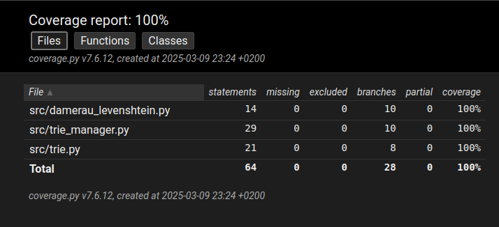

# Testaus

Sovellusta on testattu sekä automaattisilla yksikkö- ja integraatiotesteillä että manuaalisesti. Testeissä käytetään pientä sanastoa ```test_vocabulary.txt```.

## Testikattavuus

Testikattavuus 9.3.2025. Tietorakenteita ja algoritmia käsittelevän koodin testikattavuus on 100%.



## Yksikkö- ja integraatiotestaus

Sovellusta on testattu automaattisilla unittestin yksikkö- ja integraatiotesteillä. 

Testit testaavat pääasiassa trie-tietokannan toimintaa, mutta se on hyvin ytimessä sovelluksen toiminnassa. Testi ```test_get_distances``` testaa ```TrieManagerin``` ja ```damerau_levenshtein```-funktion yhteistoimintaa.

Luokka [TestTrieStructure](../src/trie.py) testaa ```Trie```-oliota, ja luokka [TestTrieManager](../src/tests/trie_manager_test.py) testaa ```TrieManager```-oliota sekä sen kanssakäymistä ```Trie```-olion kanssa.

## Manuaalinen testaus

Moduulin ```main.py``` toimintaa on testattu manuaalisesti. Monet sovelluksen antamat vastaukset ovat helposti pääteltävissä ja sanastotiedostot helposti näkyvissä, joten siten testaaminen kävi helposti manuaalisesti. Esimerkiksi tilanteissa, joissa kirjoitetaan tarkoituksella sana väärin, on oletettavaa, että sovellus kertoo, että sana on kirjoitettu väärin ja ehdottaa toista sanaa.

Manuaalisessa testauksessa opin, että ohjelma ehdottaa aakkosjärjestyksessä seuraavaa sanaa, jos samalla etäisyydellä olevia sanoja olisi useita.