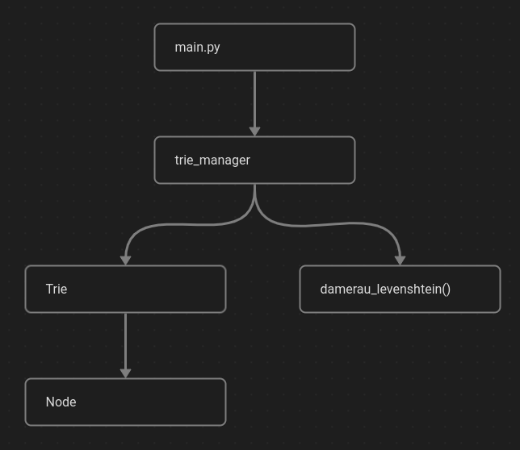

# Toteutusdokumentti

## Ohjelman yleisrakenne



Sovelluksen käynnistää moduuli ```main.py```. 

Moduuli ```trie_manager.py``` käsittelee kaikki komennot ```main.py```:n sekä ```Trie```:n ja ```damerau_levenshtein```in välillä.

Olio ```Trie``` käyttää solmuinaan olioita ```Node```.


## Saavutetut aika- ja tilavaativuudet

Damerau-Levenshtein -etäisyysmitan vaativuudet ovat ```O(M*N)```, missä M ja N ovat merkkijonojen pituudet.

## Työn puutteet ja parannusehdotukset

Tällä hetkellä kahden sanan etäisyyttä mitatessa Damerau-Levenshtein -mitalla, damerau_levenshtein-metodille syötetään sanaston sanat suoraan txt-tiedostosta, eikä trie-tietorakenteesta. Sanojen hakeminen triestä olisi varmaan tämän kurssin kannalta ollut suotavampaa.

## Laajojen kielimallien käyttö

Käytin ChatGPT:tä kerran tukena Damerau-Levenshtein -etäisyysmitan ymmärtämiseen. Muuten en käyttänyt laajoja kielimalleja tällä kurssilla.

## Viitteet

- [Trie, Wikipedia](https://en.wikipedia.org/wiki/Trie)
- [Damerau-Levenshtein distance, Wikipedia](https://en.wikipedia.org/wiki/Damerau%E2%80%93Levenshtein_distance)
- [Damerau-Levenshtein distance, GeeksForGeeks](https://www.geeksforgeeks.org/damerau-levenshtein-distance/)